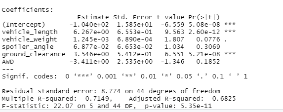
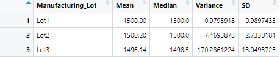
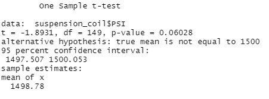
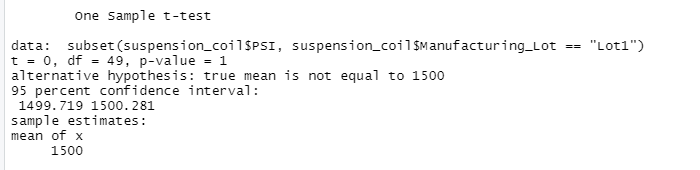
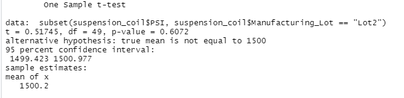
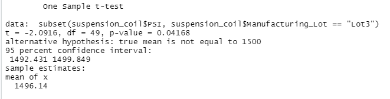

# MechaCar_Statistical_Analysis

## Linear Regression to Predict MPG

* The variables/coefficients which provided a non-random amount of variance to the mpg values in the dataset were "vehicle length" and "ground clearance."
* The slope of the linear model would not be considered to be zero since the p-value is 5.3E-11, which is less than 0.05, indicating that the results of the analysis are     significant, and that one can reject the null hypothesis. 
* The linear model does predict mpg of MechaCar prototypes effectively since the r-squared value is equivalent to  0.7149. Therefore, 71.5% of the variability of our   dependent variable, mpg, is explained using this linear model.           

## Summary Statistics on Suspension Coils

* The design specifications for the MechaCar suspension coils dictate that the variance of the suspension coils must not exceed 100 pounds per square inch.The current manufacturing data meets this design specification for all manufacturing lots in total, since the variance for the total lots is equivalent to 62.29, which is less than 100. 
* Lot 1 also meets this design specification, since the variance, 0.98 is less than 100.
* Lot 2 additionally meets this design specification, since the variance, 7.47, is less than 100.
* Lot 3 does not meet this design specification, since its variance, 170.29, is greater than 100. 

## T-Tests on Suspension Coils
T-test for all Lots:

T-test for Lot1:

T-test for Lot2:

T-test for Lot3:

* The PSI for all manufacturing lots is not statistically different from the population mean of 1,500 pounds per square inch, since the p value derived from the t-test, 0.06, is not less than 0.05.
* The PSI for lot 1 is is not statistically different from the population mean of 1,500 pounds per square inch, since the p value derived from the t-test, 1, is not less than 0.05.
* The PSI for lot 2 is is not statistically different from the population mean of 1,500 pounds per square inch, since the p value derived from the t-test, 0.607, is not less than 0.05.
* The PSI for lot 3 is is statistically different from the population mean of 1,500 pounds per square inch, since the p value derived from the t-test, 0.04, is less than 0.05.

## Study Design: MechaCar vs Competition
* There are other potential studies that can be conducted to quantify how the MechaCar performs against the competition. For example, cost of the MechaCar can be compared to other cars:
* In this scenario, the null hypothesis would be that there is no statistical difference between the cost of the MechaCar and the cost of other cars. 
* The alternative hypothesis would be that there is a statistical difference between the cost of the MechaCar and the cost of other cars, and that the cost of the MechaCar is either higher or lower than other cars.
* The statistical test one would you use to test this hypothesis would be the two-sample t-test, since that allows us to measure the effect in either direction.
* The data required for this test is a summary of the cost of the MechaCar and the cost of other cars, so a the two-sample t-test can be performed. 
